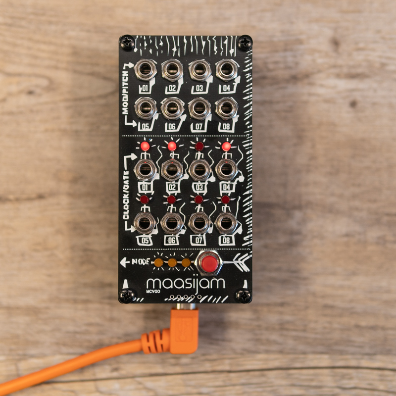
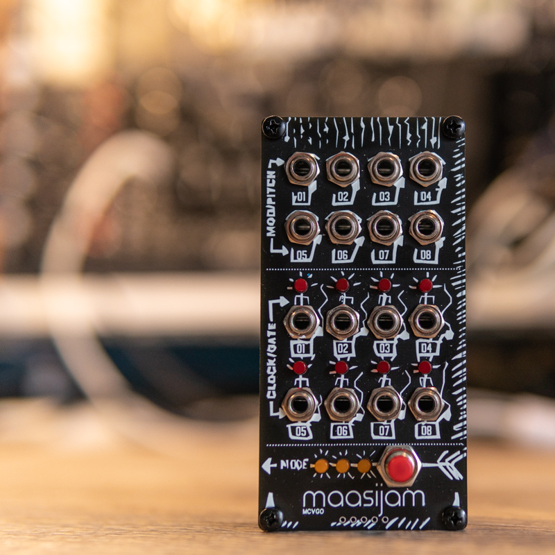
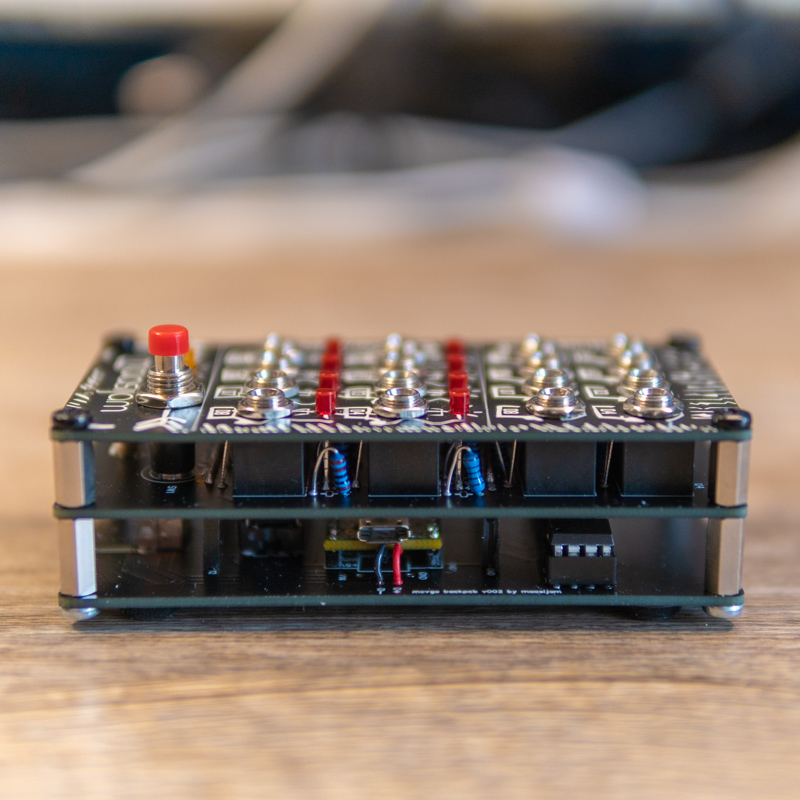
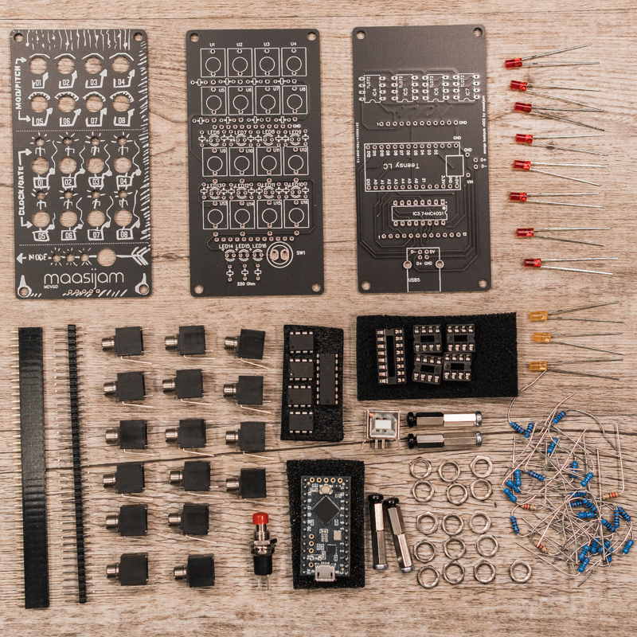

# MCVGO
Teensy based USB-MIDI to CV/Gate/Clock interface.

Inspired by the 12 Gate 16 CV USB MIDI interface from little-scale
https://little-scale.blogspot.com/2019/01/12-gate-16-cv-usb-midi-interface-bom.html

Overview:

* CV pitch/velocity/mod output from 0V to 4V (four octaves pitch range)
* Gates/triggers/clock output 0 and 5V
* Class Compliant (no driver needed)
* Tested with Teensy LC
* 6 modes:
  * mode 0 (000): CV Pitch (1-8), Gates (1-8)
  * mode 1 (100): CV Pitch/Vel (1-4/5-8), Gates (1-4), Clock 24ppqn (5), Clock 1/4 (6), Clock 1/2 (7), Gate Run/Stop (8)
  * mode 2 (110): CV Pitch/Mod (1-4/5-8), Gates (1-4), Clock 24ppqn (5), Clock 1/4 (6), Clock 1/2 (7), Gate Run/Stop (8)  
  * mode 3 (111): CV Mod (1-8), Clock 24ppqn (1), Clock 1/4 (2), Clock 1/2 (3), Clock 1/8 (4), Clock 1/16 (5), Clock 1/4 T (6), Trigger Start(7), Gate Run/Stop (8)
  * mode 4 (001): CV Pitch/Vel (1-2/5-6), CV Mod (3-4/7-8), Gates (1-2), Clock 24ppqn (3), Clock 1/4 (4), Clock 1/2 (5), Clock 1/8 (6), Trigger Start(7), Gate Run/Stop (8)
  * mode 5 (011): CV Mod (1-8), Gates (1-4), Clock 24ppqn (5), Clock 1/4 (6), Clock 1/2 (7), Gate Run/Stop (8)
* Long press button to save the selected mode as default mode

